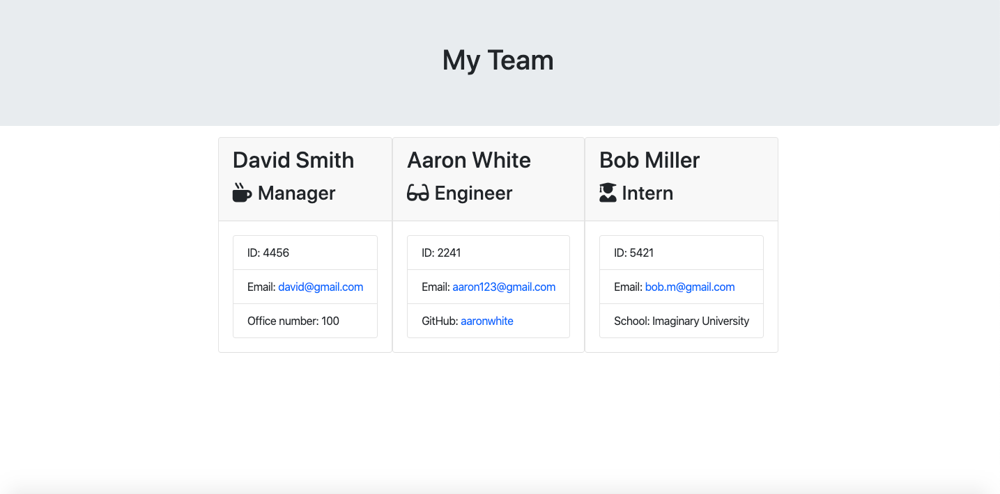
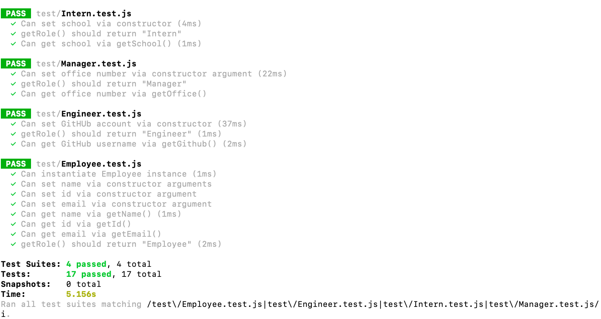

# Employee Template

This is a command line interface program that generates a HTML file, with a team of employees, based on user input. The user is prompted with questions regarding name, id number, email, github username, school, and office number.

### Demo

Part 1


Part 2


Part 3


### Example HTML



## Table of Contents

1. [Installation](#Installation)
2. [Usage](#Usage)
3. [Tests](#Tests)
4. [Questions](#Questions)

## Installation

Install node if you haven't already: https://nodejs.org/en/download/

Then install the following npm modules:

- "jest": "^24.8.0"
- "inquirer": "^6.3.1

i.e. npm install jest@24.80

## Usage

1. Enter this comand:

```sh
node app.js
```

2. Answer the questions that you are prompted, until you don't want to add anymore employees.

3. A new html file named 'team.html' in the directory 'output' is created with your team of employees.

## Tests

Make sure "jest": "^24.8.0" is installed and then enter this command:

```sh
npm test
```



## Questions

Email: dustin.irving@gmail.com
